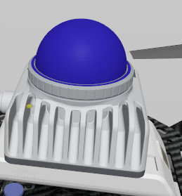
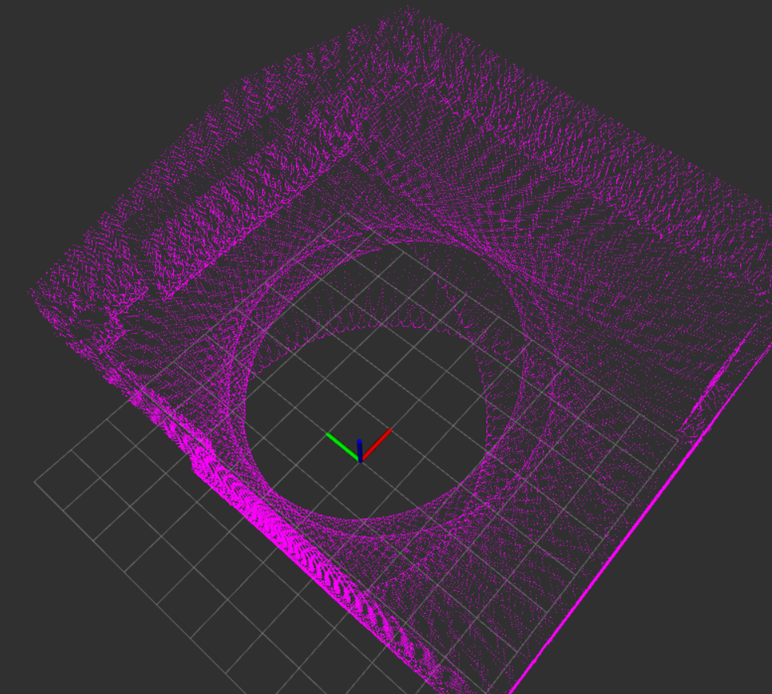

# Gazebo Harmonic MID-360 仿真插件

Gazebo Classic 已于 2025 年 1 月停止维护，原有的
[`Livox-SDK/livox_laser_simulation`](https://github.com/Livox-SDK/livox_laser_simulation)
无法直接用于新版 Gazebo。本项目将 MID-360 仿真插件移植到
**Ubuntu 22.04 + ROS 2 Humble + Gazebo Harmonic**，并提供
`PointCloud2`、Livox `CustomMsg` 和 IMU 接口，可无缝接入
FAST-LIO2 ROS 2 版。

如果本项目对您有帮助，欢迎点亮右上角的 ⭐ **Star**！

<p align="center">
  
  
</p>

## 功能

- MID-360 非重复扫描轨迹。
- 200,000 点/秒，10 Hz，每帧 20,000 条射线。
- 保留 `line`、`offset_time`、`tag` 和 `reflectivity`。
- 发布 `sensor_msgs/msg/PointCloud2`、`livox_ros_driver2/msg/CustomMsg`
  和 `sensor_msgs/msg/Imu`。
- 基于 Gazebo `collision` 几何和 Embree 批量求交。
- 支持静态、动态模型与自机排除。

## 部署

### 1. 安装编译依赖

```bash
sudo apt update
sudo apt install build-essential cmake python3-colcon-common-extensions \
  libassimp-dev libtbb-dev
```

Embree 4.4.0 会在首次编译时自动下载。

### 2. 创建工作空间并下载项目

```bash
mkdir -p ~/mid360_ws/src
cd ~/mid360_ws/src
git clone https://github.com/ashduwihch/mid360_gazebo_harmonic.git
```

`git clone` 会在 `src` 下创建 `mid360_gazebo_harmonic` 目录。

### 3. 编译

```bash
cd ~/mid360_ws
source /opt/ros/humble/setup.bash
colcon build --symlink-install \
  --cmake-args -DCMAKE_BUILD_TYPE=Release
```

这组指令会进入 `mid360_ws` 工作空间，加载 ROS 2 Humble，
然后编译 `src` 下的全部软件包。`--symlink-install` 方便修改模型和配置，
`Release` 用于启用性能优化。

Livox `CustomMsg` 消息类型由 `livox_ros_driver2` 提供。需要该输出时，
请先自行准备 `livox_ros_driver2`。

### 4. 永久加载环境

将以下内容加入 `~/.bashrc`：

```bash
source /opt/ros/humble/setup.bash
source ~/mid360_ws/install/setup.bash
```

然后执行：

```bash
source ~/.bashrc
```

之后新开终端即可使用插件。

## 测试

启动自带测试世界：

```bash
ros2 launch mid360_simulation_plugin_ros2 mid360_test.launch.py
```

新开终端检查话题：

```bash
ros2 topic type /livox/lidar
ros2 topic type /livox/imu
ros2 topic hz /livox/lidar
ros2 topic hz /livox/imu
```

## 输出类型

单独 MID-360 模型的配置位于：

```text
~/mid360_ws/src/mid360_gazebo_harmonic/packages/mid360_simulation_plugin_ros2/models/mid360/model.sdf
```

X500 组合模型的配置位于：

```text
~/mid360_ws/src/mid360_gazebo_harmonic/packages/mid360_simulation_plugin_ros2/models/x500_gimbal_mid360/model.sdf
```

在对应文件中找到 `<publish_pointcloud_type>` 后设置输出类型。

`PointCloud2`：

```xml
<publish_pointcloud_type>2</publish_pointcloud_type>
```

Livox `CustomMsg`：

```xml
<publish_pointcloud_type>3</publish_pointcloud_type>
```

## 在 world 中使用

在 `<world>` 中加入一次 Embree 地图系统：

```xml
<plugin name="rmagine_gazebo_plugins::RmagineEmbreeMapSystem"
        filename="librmagine_embree_map_system.so">
  <update>
    <rate_limit>30</rate_limit>
    <delta_trans>0.001</delta_trans>
    <delta_rot>0.001</delta_rot>
  </update>
</plugin>
```

然后在 world 或机器人模型中引入 MID-360：

```xml
<include>
  <uri>model://mid360</uri>
</include>
```

## 项目结构

```text
mid360_gazebo_harmonic/
└── packages/
    ├── mid360_simulation_plugin_ros2/
    ├── rmagine/
    └── rmagine_gazebo_plugins/
```

三个编译组件已放在同一个仓库中，使用者只需下载这一个项目。

## 许可证

MID-360 插件使用 MIT 许可证。`rmagine` 相关代码保留 BSD-3-Clause
许可证，详见 [`THIRD_PARTY.md`](THIRD_PARTY.md)。
